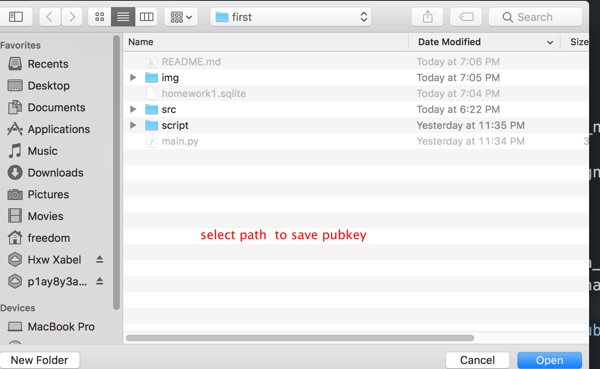
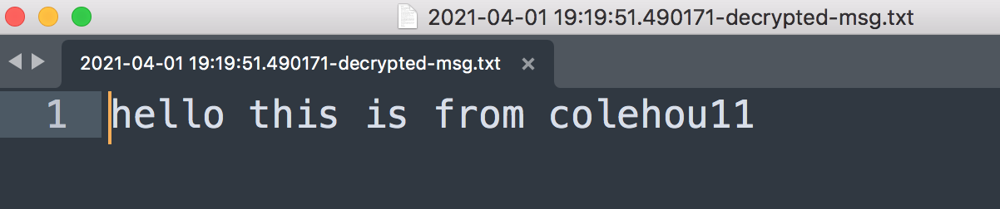

<!--
 * @Description: Editor's info in the top of the file
 * @Author: p1ay8y3ar
 * @Date: 2021-03-30 14:42:18
 * @LastEditor: p1ay8y3ar
 * @LastEditTime: 2021-04-01 19:39:24
 * @Email: p1ay8y3ar@gmail.com
-->

# Run

`python main.py`

The core functions are in the `/script/passcoder.py` file.

Other codes are UI and logic functions

# Features

## user part

### user register

### user login

## PKS part

login success

### key generate

when reg successed ,will auto gen rabin and rsa key,then store to datebase.

if wan to regenerate key,can push **reg_allkey** button

### down public key

push **dl_rabin_pubkey** and select path to save pubkey

and `*.pub_rabin` file with **signature** added on,now we use another account to verify this signature

### verify signature

if we use diffrent rsa pubkey to verify

### resign

you can push button **reg_allkey** then push **dl_rabin_pubkey** it will resign automatic

## encrypt msg

now account is **colehou11**,we use **colehou22**'s rabin public to encrypt a msg

now we use account **colehou22** to decypted this msg

success

# todo list

- [x] sqllite for user store

- [x] 用户密码使用 md5 保存
- [x] 其他的各种设置

- [x] 质数工具 PrimeTools

  - [x] gcd `euclid`
  - [x] exGcd `exEuclid`
  - [x] fast_mod `fast_mod`
  - [x] miller-rabin `MillerRabin` and `MBTest`
  - [x] generate big prime `prime` and `gen_big_prime`
  - [x] 模逆 `modular_inverse`

- [x] Utils

  - [x] string to num `str2num`
  - [x] num to string `num2str`

- [x] PKSRabin

  - [x] 产生私钥和公钥`keygen`
  - [x] 加密`encrypt`
  - [x] 解密 `decrypt`

- [x] RsaSignaturer

  - [x] `sign`
  - [x] `unsign`

- [x] ui interface num
