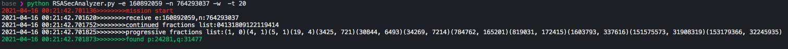
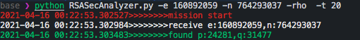
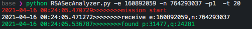
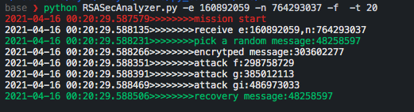
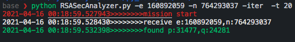
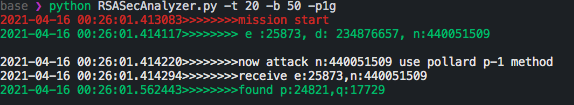
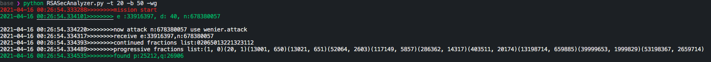

<!--
 * @Description: Editor's info in the top of the file
 * @Author: p1ay8y3ar
 * @Date: 2021-04-15 23:42:51
 * @LastEditor: p1ay8y3ar
 * @LastEditTime: 2021-04-16 00:29:54
 * @Email: p1ay8y3ar@gmail.com
-->

# HOW TO USE

help list

```shell
$ python RSASecAnalyzer.py -h
usage: RSASecAnalyzer.py [-h] [-e E] [-n N] [-b B] [-t T] [-p1] [-rho] [-w]
                         [-iter] [-f] [-p1g] [-wg]

optional arguments:
  -h, --help  show this help message and exit
  -e E        public e
  -n N        public n
  -b B        bits length
  -t T        time in seconds
  -p1         pollard p-1 factor n
  -rho        pollard rho facotr (use brent)
  -w          wiener
  -iter       iter attack
  -f          franklin reiter
  -p1g        pollard p-1 test
  -wg         wiener test
```

## wiener's attack

example
```shell
python RSASecAnalyzer.py -e 160892059 -n 764293037 -w  -t 20
```


## pollard rho factor n (use brent circle judge)

example 
```shell
python RSASecAnalyzer.py -e 160892059 -n 764293037 -rho  -t 20
```


## plooard p-1 factor 

example 
```
python RSASecAnalyzer.py -e 160892059 -n 764293037 -p1  -t 20
```


## recovery message

example

```shell
python RSASecAnalyzer.py -e 160892059 -n 764293037 -f  -t 20
```



## iter attack

example

```shell
python RSASecAnalyzer.py -e 160892059 -n 764293037 -iter  -t 20
```




## automatic generate use_case and test it 

### p-1 test 
example 
```shell
python RSASecAnalyzer.py -t 20 -b 50 -p1g                    
```


### wiener test 

example 
```shell
python RSASecAnalyzer.py -t 20 -b 50 -wg 
```




## timeout setting 


python RSASecAnalyzer.py -t **5** -b 500 -p1g
2021-04-16 **00:27:52**.261734>>>>>>>>mission start 
2021-04-16 00:27:52.307163>>>>>>>> e :772052531718282037774187384073790383774743887, d: 1272354353988187049380241330966539357061823718330295695426086392982353799484710427689375919, n:1731481365652957182725242119952025433868142810858241815159728692305742857136417132325743683 
 
2021-04-16 00:27:52.307241>>>>>>>>now attack n:1731481365652957182725242119952025433868142810858241815159728692305742857136417132325743683 use pollard p-1 method 
2021-04-16 00:27:52.307855>>>>>>>>receive e:772052531718282037774187384073790383774743887,n:1731481365652957182725242119952025433868142810858241815159728692305742857136417132325743683 
2021-04-16 **00:27:57**.291426>>>>>>>>timeout exiting... 
