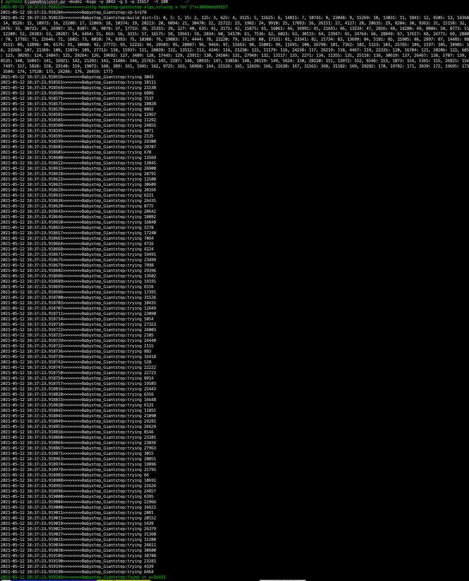

<!--
 * @Description: Editor's info in the top of the file
 * @Author: p1ay8y3ar
 * @Date: 2021-05-11 20:10:12
 * @LastEditor: p1ay8y3ar
 * @LastEditTime: 2021-05-12 18:42:35
 * @Email: p1ay8y3ar@gmail.com
-->


# how to use it 


# generate weak key paramaters

```python
python3 ElgamaAnalyser.py -mode1
```


# fuzzing 
## bsgs

```python 
python3 ElgamaAnalyser.py -mode2 -bsgs -y 3043 -g 5 -p 31657  -t 100
```



## pohilg hellman 

```python
ython3 ElgamaAnalyser.py -mode2 -hellman  -y 3043 -g 5 -p 31657  -t 100
```


## pollard's method

```python
python3 ElgamaAnalyser.py -mode2 -rho -y 142411 -g 2 -p 144341  -t 100
```


## all in the same time 

```python
python3 ElgamaAnalyser.py -mode2 -rho -bsgs -hellman  -y 142411 -g 2 -p 144341  -t 100
```


