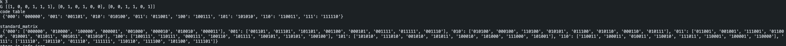
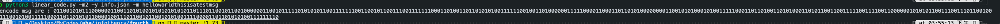
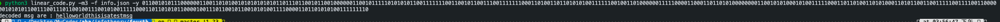

<!--
 * @Description: Editor's info in the top of the file
 * @Author: p1ay8y3ar
 * @Date: 2021-05-08 15:52:08
 * @LastEditor: p1ay8y3ar
 * @LastEditTime: 2021-05-08 15:57:19
 * @Email: p1ay8y3ar@gmail.com
-->


# mode1 generate code table 

for example 
```python
python3 linear_code.py -m1  -r 0.4  -n 6 -p 0.2
```




# mode2 to encode msg

```python
python3 linear_code.py -m2 -y info.json -m helloworldthisisatestmsg 
```


# mode3 decode msg 
```python
python3 linear_code.py -m3 -f info.json -y 011001010111000000110011010100101010101010110111011001011001000000110010111110101010110011111110011001011001110011111110001101001101101010100111111001001101000000111110000110001101101010000000011001010100010100111110001101101001101010001101011001100111110011110011000000101010110011100111011001001110010100111110001101101010110000100111011001011001010100111100001101101010100111111110
```
